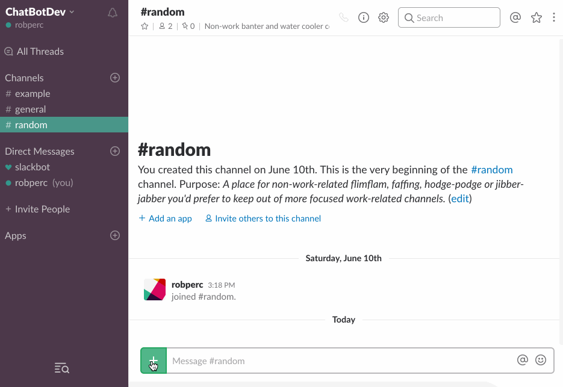
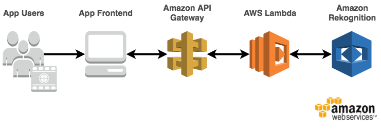

# Serverless Hotdog Detector

This example shows you how to build a [serverless](https://aws.amazon.com/serverless/#getstarted) hotdog detecting chat app on AWS using [Amazon API Gateway](https://aws.amazon.com/api-gateway/), [AWS Lambda](https://aws.amazon.com/lambda/), and [Amazon Rekognition](https://aws.amazon.com/rekognition/).

This example is intended to integrate with [Slack](https://slack.com/), but could also be modified to work with other popular chat apps such as [Facebook Messenger](https://www.messenger.com/).

This repository contains sample code the Lambda function depicted in the diagram below as well as an [AWS CloudFormation](https://aws.amazon.com/cloudformation/) template for creating the function and related resources.

To see some of the other real-world examples of Rekognition in action check out the [Image Recognition and Processing Backend Serverless reference architecture](https://github.com/awslabs/lambda-refarch-imagerecognition)



## Walkthrough of the Architecture
1. A user posts a message containing the image to perform hotdog detection on in a Slack channel monitored by the chat app.
1. Slack posts the message to an Amazon API Gateway API for the chat app.
1. The API triggers an invocation of the chat app Lambda function which performs the following:
  1. Amazon Rekognition’s image recognition and labelling feature scans the image and returns a list of detected labels.
  1. The list of labels is checked for those corresponding to hotdogs to determine if the image contained a hotdog.
  1. A message is posted to the chat channel detailing whether the image was a hotdog or not.



## Running the Example
### Preparing Slack
First make sure you're logged in to Slack, then follow these instructions to prep your app:
1. [Create an app](https://api.slack.com/apps?new_app=1) ([Documentation](https://api.slack.com/slack-apps#creating_apps))
1. From the `Basic Information` tab under `Settings` take note of the `Verification Token` as it will be required later
1. Navigate to the `OAuth & Permissions` tab under `Features`
1. Under the `Permissions Scopes` section add the following permission scopes
    * channels:history
    * chat:write:bot
    * files:read
    * files:write:user
1. Click `Save Changes`
1. Click `Install App to Team` then `Authorize` then note the `OAuth Access Token` as it will be required later

### Launching the App Backend on AWS
#### Option 1: Launch the CloudFormation Template in US West - Oregon (us-west-2)
The backend infrastructure can be deployed in US West - Oregon (us-west-2) using the provided CloudFormation template.
Click **Launch Stack** to launch the template in the US West - Oregon (us-west-2) region in your account:

[](***REPLACE_THIS_VALUE***)

(On the last page of the wizard, make sure to:

1. Click the checkboxes to give AWS CloudFormation permission to **"create IAM resources"** and **"create IAM resources with custom names"**
1. Follow the instructions to **"Create Change Set"** 
1. Click **"Execute"**
)

#### Option 2: Launch the CloudFormation Template Manually 
If you would like to deploy the template manually, you need a S3 bucket in the target region, and then package the Lambda functions into that S3 bucket by using the `aws cloudformation package` utility.

Set environment variables for later commands to use:

```bash
S3BUCKET=[REPLACE_WITH_YOUR_BUCKET]
REGION=[REPLACE_WITH_YOUR_REGION]
STACKNAME=[REPLACE_WITH_DESIRED_NAME]
VTOKEN=[REPLACE_WITH_VERIFICATION_TOKEN]
ATOKEN=[REPLACE_WITH_OAUTH_ACCESS_TOKEN]
```

Then go to the `cloudformation` folder and use the `aws cloudformation package` utility

```bash
cd cloudformation

aws cloudformation package --region $REGION --s3-bucket $S3BUCKET --template hotdog_detector.serverless.yaml --output-template-file hotdog_detector.output.yaml
```
Last, deploy the stack with the resulting yaml (`hotdog_detector.output.yaml`) through the CloudFormation Console or command line:

```bash
aws cloudformation deploy --region $REGION --template-file hotdog_detector.output.yaml --stack-name $STACKNAME --capabilities CAPABILITY_NAMED_IAM --parameter-overrides VerificationToken=$VTOKEN AccessToken=$ATOKEN
```

### Finalize Slack Event Subscription
1. Navigate to the created stack in the CloudFormation console and note the value for the `RequestURL` output from the created stack as it will be required later
1. Return to the Slack app settings page for the Slack app created earlier
1. Navigate to the `Event Subscriptions` tab under `Features` and enable events
1. In the `Request URL` field enter the `RequestURL` value noted earlier
1. Click `Add Team Event` and select `message.channels`
1. Click `Save Changes`


## Testing the Example
To test the example go to the Slack team you configured the Slack app for and try uploading images of different foods to see the results.


## Cleaning Up the Stack Resources

To remove all resources created by this example, do the following:

1. Delete the CloudFormation stack.
1. Delete the CloudWatch log groups associated with each Lambda function created by the CloudFormation stack.

## CloudFormation Template Resources
The following sections explain all of the resources created by the CloudFormation template provided with this example.

### AWS Lambda
- **HotdogDetectorFunction** - Lambda function that validates incoming Slack event messages, checks them for images containing explicit content, and orchestrates the removal of images found to contain explicit content from Slack.
- **HotdogDetectorFunctionHotdogDetectorAPIPostPermissionTest** - Implicitly created Lambda permission, allows API Gateway Test stage to call Lambda function.
- **HotdogDetectorFunctionHotdogDetectorAPIPostPermissionProd** - Implicitly created Lambda permission, allows API Gateway Prod stage to call Lambda function.

### AWS IAM
- **LambdaRekognitionRole** - IAM Role with policy that allows Lambda function to invoke "rekognition:DetectLabels" API call and write log messages to CloudWatch Logs.

### Amazon API Gateway
- **HotdogDetectorAPI:** - API for hotdog detector app
- **HotdogDetectorAPIProdStage** - Implicitly created production stage for API
- **HotdogDetectorAPIDeploymentXXXXXXXXX** - Implicitly created deployment for production stage of API


## License

This reference architecture sample is licensed under Apache 2.0.
